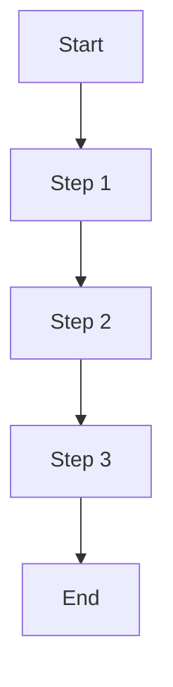

# Knowledge Pill Template

> **Summary:**  
> Provide a brief description of the topic or procedure. State its purpose, scope, and expected outcome. This section should help readers quickly understand what this knowledge pill covers.

---

## Table of Contents

- [Overview](#overview)
- [Prerequisites](#prerequisites)
- [Step-by-Step Procedure](#step-by-step-procedure)
- [Troubleshooting & Tips](#troubleshooting--tips)
- [Example Diagram](#example-diagram)
- [References & Further Reading](#references--further-reading)
- [Contributors](#contributors)
- [Change Log](#change-log)

---

## Overview

Describe the general concept or process addressed by this knowledge pill.

- What is the main objective?
- Why is it important?
- Who should use this procedure (target audience)?

---

## Prerequisites

List all requirements needed before starting the procedure.

- Necessary tools, permissions, or prior knowledge
- Any setup or configuration steps that must be completed in advance
- Optional: Link to related setup guides or documentation

---

## Step-by-Step Procedure

For each step, use the following format:

### Step X: [Short Title of Step]

**Description:**  
Explain the purpose of this step and what it achieves.

**Actions:**

- List the actions to be performed in this step.
- Use bullet points or numbered lists for clarity.
- Optionally, include example commands, code snippets, or configuration details.

**Expected Outcome:**  
Describe what should happen after completing this step.

**Optional Image:**

- If relevant, add a link to an image or diagram that illustrates the step.
- Example:  
  ``

---

## Troubleshooting & Tips

- List common issues that may arise and how to resolve them.
- Share best practices or recommendations for successful execution.
- Include notes or warnings as needed.

---

## Example Diagram

Below is an example of a simple flow diagram using [Mermaid](https://mermaid-js.github.io/mermaid/#/):

> Replace or extend this diagram to visualize your specific process or workflow.

---

## References & Further Reading

- Link to related documentation, guides, or external resources.
- Provide additional reading for deeper understanding.

---

## Contributors

| Name               |    Contact/Handle    | Role                |
| ------------------ | :------------------: | ------------------- |
| [Contributor Name] | [Contact or Profile] | [Role/Contribution] |

---

## Change Log

| Date       | Version | Changes           | Author        |
| ---------- | ------- | ----------------- | ------------- |
| YYYY-MM-DD | 1.0     | Initial creation  | [Author Name] |
| YYYY-MM-DD | 1.1     | Updates and fixes | [Author Name] |

---

> **How to Use:**
>
> - Copy this template into your documentation repository.
> - Fill in each section with procedure-specific details.
> - Replace placeholder text with actual content.
> - Add images, diagrams, or Mermaid charts where helpful.
> - Review formatting in Markdown preview.

---

This template is designed to be technology-agnostic and adaptable for documenting any technical concept or procedure. Use it to ensure clarity, consistency, and completeness in your knowledge documentation.